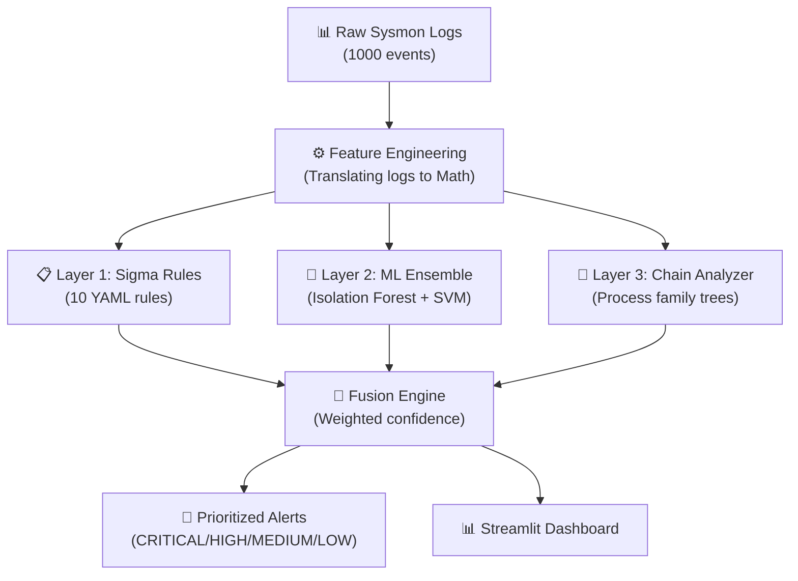

# 🛡️ LOLBins Hybrid Detection Engine


Welcome to the **LOLBins Hybrid Detection Engine**! This is a cybersecurity portfolio project designed to catch clever hackers who try to hide in plain sight. It combines strict security rules with Artificial Intelligence to flag suspicious activity on a computer system.

---

## 📖 The Problem: What are "LOLBins"? (Explained Simply)

Imagine a bank robber who doesn't break in wearing a ski mask, but instead steals a security guard's uniform and walks right through the front door. Because they are wearing the right uniform, the regular security cameras ignore them.

In cybersecurity, hackers do the exact same thing. Instead of downloading obvious viruses (which your antivirus software would instantly catch), they use tools that are **already built into Windows** to do their hacking. These tools are called **LOLBins** ("Living Off the Land" Binaries). 

Because these tools (like `PowerShell`, `certutil`, or `cmd`) are officially made and signed by Microsoft, standard antivirus software completely ignores them.

**This project is a custom-built security engine designed to catch these disguised hackers.**

---

## 🧠 The Solution: How This Engine Works

If regular antivirus can't catch LOLBins, how do we? We built a **3-Layer Defense System**. Think of it like three different security guards, each looking for something different.

### 👮 Layer 1: The Rule Book (Sigma Rules)
This is like a bouncer at a club holding a "Banned List." We give the engine a list of strict rules. For example, one rule says: *"If the built-in Windows Certificate Tool (`certutil.exe`) is used to download a file from the internet, sound the alarm."* 
* **The Good:** It is incredibly accurate and fast at catching known hacking tricks.
* **The Bad:** If the hacker uses a brand new trick that isn't on the list, the bouncer lets them in.

### 🤖 Layer 2: The AI Brain (Machine Learning)
Because hackers change their tricks constantly, we need an AI that looks for "weirdness" instead of a strict list. We trained an Unsupervised Machine Learning model on what a normal workday looks like. 
When the AI sees something weird—like an encrypted, 500-character long PowerShell command running at 3:00 AM—it flags it as an "Anomaly," even if there is no rule for it!
* **The Good:** It catches brand-new, never-before-seen hacking tricks.

### 🕵️ Layer 3: The Detective (Behavioral Chain Analysis)
This layer looks at the "Family Tree" of a program. If `cmd.exe` (the command prompt) opens, that's normal. But what if Microsoft Word (`winword.exe`) suddenly opens `cmd.exe`? That almost never happens in real life, and it usually means a hacker hid a virus inside a Word document macro! The detective connects these dots.

### 🔀 The Fusion Engine (Bringing it all together)
Finally, all three layers combine their notes. If multiple layers flag the same event, the engine gives it a **CRITICAL** alert score. If only the AI thinks it looks a little weird, it might just get a **MEDIUM** score.

---

## 🏗️ Technical Architecture 

Here is how the data flows through the program from start to finish:



---

## 📊 Where Did the Data Come From?

**We did NOT download an existing dataset from the internet.** 

In the real world, you would get this data from a Windows system using a tool called "Sysmon" (System Monitor), which tracks every single program that opens on a computer. Because we didn't have thousands of hacked computers to pull data from, **we built a script to generate our own highly realistic dataset.**

Our `generate_synthetic_data.py` script created 1,000 mathematically accurate Windows logs:
*   **800 Benign Events:** Normal things a regular employee does (like opening Google Chrome).
*   **100 Malicious Events:** Specific, known hacking techniques using LOLBins.
*   **100 Gray-Area Events:** Tricky actions that an IT administrator might do legitimately, but that look suspicious (to make sure our engine doesn't accidentally ban the IT guy).

When we ran these 1,000 logs through the engine, **it successfully caught 100% of the malicious attacks**.

---

## 💻 How to run it on your own machine

You don't need a complex Windows lab to run this! The data generator allows you to test the engine on Mac, Linux, or Windows.

### Step 1: Install Python and Download the Code
Download this folder to your computer, open your terminal, and navigate into the folder:
```bash
cd path/to/lolbins-detection-engine
```

### Step 2: Install the required packages
Run this command to install the necessary Python libraries:
```bash
pip install -r requirements.txt
```

### Step 3: Generate the Data
Let's generate the 1,000 realistic Windows logs.
```bash
python3 src/generate_synthetic_data.py
```

### Step 4: Run the Detection Engine
Now, let's feed those logs into our 3-Layer engine!
```bash
python3 src/detection_pipeline.py
```

### Step 5: View the Interactive Dashboard!
I built a sleek web dashboard so you can visually see the alerts, just like a real security analyst would. Run this command:
```bash
python3 -m streamlit run dashboard/app.py
```
Your browser will open automatically!

---

## 🎯 MITRE ATT&CK Techniques Covered
This engine successfully detects the following real-world attack techniques defined by the industry-standard MITRE ATT&CK framework:

| ID | Technique | Tactic | LOLBin Targeted |
|----|-----------|--------|--------|
| T1105 | Ingress Tool Transfer | Command & Control | `certutil.exe` |
| T1218.005 | Mshta | Defense Evasion | `mshta.exe` |
| T1218.010 | Regsvr32 Squiblydoo | Defense Evasion | `regsvr32.exe` |
| T1218.011 | Rundll32 | Defense Evasion | `rundll32.exe` |
| T1059.001 | PowerShell Encoded | Execution | `powershell.exe` |
| T1204.002 | Malicious File (Macro) | Execution | `Office → cmd` |
| T1197 | BITS Jobs | Defense Evasion | `bitsadmin.exe` |
| T1127.001 | MSBuild | Defense Evasion | `MSBuild.exe` |
| T1059.005 | Visual Basic/JScript | Execution | `wscript/cscript` |
| T1140 | Deobfuscate/Decode | Defense Evasion | `certutil.exe` |

---

## 👨‍💻 About the Author
Built by **Eswar Achari** as a cybersecurity portfolio project demonstrating Blue Team detection engineering, Python development, and Machine Learning capabilities for Security Operations Center (SOC) roles.
