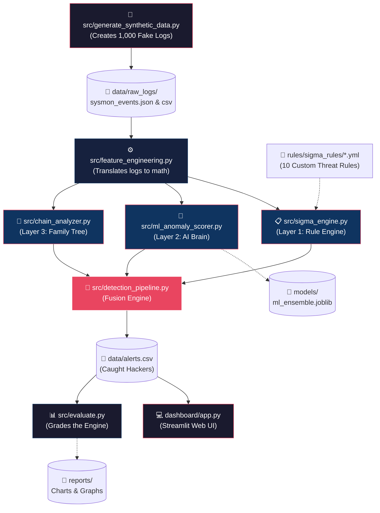

# 🛡️ LOLBins Hybrid Detection Engine


Welcome to the **LOLBins Hybrid Detection Engine**! This is a comprehensive cybersecurity portfolio project designed to detect advanced hackers who try to hide their tracks by using legitimate Windows tools for malicious purposes.

---

## 📖 The Problem: What are "LOLBins"? (Explained Simply)

Imagine a bank robber who doesn't break in wearing a ski mask, but instead steals a security guard's uniform and walks right through the front door. Because they are wearing the right uniform, the regular security cameras ignore them.

In cybersecurity, hackers do the exact same thing. Instead of downloading obvious viruses (which your antivirus software would instantly catch), they use tools that are **already built into Windows** to do their hacking. These tools are called **LOLBins** ("Living Off the Land" Binaries). 

Because these tools (like `PowerShell`, `certutil`, or `cmd`) are officially made and signed by Microsoft, standard antivirus software completely ignores them. This project is a custom-built security engine designed to catch these disguised hackers.

---

## 🧠 The Solution: 3-Layer Architecture

If regular antivirus can't catch LOLBins, how do we? We built a **3-Layer Defense System**. Think of it like three different security guards, each looking for something different.

### 👮 Layer 1: The Rule Book (Sigma Rules)
This is like a bouncer at a club holding a "Banned List." We give the engine a list of strict rules. For example, one rule says: *"If the built-in Windows Certificate Tool (`certutil.exe`) is used to download a file from the internet, sound the alarm."* 
* **The Good:** Extremely accurate and fast at catching known hacking tricks.
* **The Bad:** If the hacker uses a brand new trick that isn't on the list, the bouncer lets them in.

### 🤖 Layer 2: The AI Brain (Machine Learning)
Because hackers change their tricks constantly, we need an AI that looks for "weirdness" instead of a strict list. We trained an Unsupervised Machine Learning model (Isolation Forest, Local Outlier Factor, and One-Class SVM) on what a normal workday looks like. 
When the AI sees something weird—like an encrypted, 500-character long PowerShell command running at 3:00 AM—it flags it as an "Anomaly," even if there is no rule for it!
* **The Good:** Catches brand-new, zero-day hacking tricks.

### 🕵️ Layer 3: The Detective (Behavioral Chain Analysis)
This layer looks at the "Family Tree" of a program. If `cmd.exe` (the command prompt) opens, that's normal. But what if Microsoft Word (`winword.exe`) suddenly opens `cmd.exe`? That almost never happens in real life, and it usually means a hacker hid a virus inside a Word document macro! The detective connects these dots.

### 🔀 The Fusion Engine (Bringing it all together)
Finally, all three layers combine their notes. If multiple layers flag the same event, the engine gives it a **CRITICAL** alert score. If only the AI thinks it looks a little weird, it might just get a **MEDIUM** score.

---

## 🌊 System Architecture & File Execution Diagram

Here is a visual representation of how the files in this repository interact with each other to process data, catch threats, and generate reports.



---

## 📂 Deep Dive: Every File Explained in Detail

To fully understand this project, here is an exhaustive breakdown of exactly what every single file and folder in this repository does. 

### 1. The Core Source Code (`src/` folder)
This folder contains the actual Python brains of the operation.
*   **`src/generate_synthetic_data.py`**
    *   **What it does:** Because we don't have thousands of hacked enterprise computers to pull logs from, this script writes its own! It generates 1,000 highly realistic "Sysmon Event ID 1" logs. 
    *   **How it works:** It uses Python's `random` libraries to create 800 completely normal workday events (like Bob in HR opening Chrome), 100 malicious events (like a hacker downloading a payload), and 100 "gray-area" events (like an IT admin running a weird script at 2 AM).
*   **`src/feature_engineering.py`**
    *   **What it does:** Machine Learning algorithms cannot read English sentences; they only understand math. This script reads the raw text logs and extracts 29 numerical "Features".
    *   **How it works:** It calculates things like the exact length of a command, checks if there is a URL present, and even uses a mathematical formula called "Shannon Entropy" to figure out if a command looks like it was encrypted by a hacker to hide its true purpose.
*   **`src/sigma_engine.py` (Layer 1)**
    *   **What it does:** This is the deterministic rule-matcher. It scans every event to see if it perfectly matches known hacker behavior.
    *   **How it works:** It reads the `.yml` rule files (stored in the `rules/` folder) and acts as a filter. If an event contains the exact bad keywords we defined, it flags it immediately.
*   **`src/ml_anomaly_scorer.py` (Layer 2)**
    *   **What it does:** This is the Artificial Intelligence layer. 
    *   **How it works:** It loads three different algorithms (Isolation Forest, Local Outlier Factor, and One-Class SVM) using the `scikit-learn` library. It looks at the baseline of 800 normal events, memorizes what "normal" looks like, and then scores every other event from 0 to 100 based on how "weird" it is.
*   **`src/chain_analyzer.py` (Layer 3)**
    *   **What it does:** This script acts as a contextual detective. 
    *   **How it works:** It looks specifically at `ParentImage` and `Image` to see who spawned who. If it sees `winword.exe` spawning `powershell.exe`, it knows immediately that this is a classic phishing macro attack and gives it a massive risk score.
*   **`src/detection_pipeline.py`**
    *   **What it does:** This is the orchestra conductor. It is the main file that runs everything else in order.
    *   **How it works:** It calls the data generator, passes the data to the feature engineer, feeds it into all three layers (Sigma, ML, Chain), and then mathematically combines their scores to output a final verdict: CRITICAL, HIGH, MEDIUM, LOW, or CLEAR.
*   **`src/evaluate.py`**
    *   **What it does:** This acts as the grader/teacher for the project. 
    *   **How it works:** It knows exactly which logs were *actually* malicious (because we generated them). It looks at the engine's final verdicts and calculates how accurate the engine was, creating Precision/Recall metrics and generating the images saved in the `reports/` folder.

### 2. The Rule Book (`rules/` folder)
*   **`rules/sigma_rules/*.yml`**
    *   **What it does:** There are 10 YAML files in here. These are written in an industry-standard format called "Sigma". They act as hardcoded signatures for the engine.
    *   **Example:** `certutil_download.yml` tells the engine: "If you see `certutil.exe` AND the word `urlcache`, it means a hacker is abusing a certificate tool to illegally download malware."

### 3. The Dashboard (`dashboard/` folder)
*   **`dashboard/app.py`**
    *   **What it does:** Python terminal output is ugly. This file creates a beautiful, interactive web interface.
    *   **How it works:** It uses the `Streamlit` library to build a UI. It reads the final `alerts.csv` file and generates interactive pie charts, bar graphs, and filterable tables so a Security Operations Center (SOC) analyst could actually use this tool to investigate threats comfortably.

### 4. The Output Folders (`data/`, `reports/`, `models/`)
*   **`data/`**: Holds all the generated CSV and JSON logs. `full_dataset.csv` is the raw logs, and `alerts.csv` is the final list of caught hackers.
*   **`reports/`**: Holds the PNG images (like confusion matrices and ROC curves) generated by `evaluate.py` proving that the engine caught 100% of the attacks.
*   **`models/`**: Holds a `.joblib` file. This is the saved "brain" of the Machine Learning model so it doesn't have to relearn what normal looks like every single time you boot it up.

---

## 💻 How to run it on your own machine

You don't need a complex Windows lab to run this! The data generator allows you to test the engine entirely on a Mac, Linux, or Windows machine.

### Step 1: Install Python and Download the Code
Download this folder to your computer, open your terminal, and navigate into the folder:
```bash
cd path/to/lolbins-detection-engine
```

### Step 2: Install the required packages
Run this command to install the necessary Python libraries (like pandas and scikit-learn):
```bash
pip install -r requirements.txt
```

### Step 3: Generate the Data
Let's generate the 1,000 realistic Windows logs.
```bash
python3 src/generate_synthetic_data.py
```

### Step 4: Run the Detection Engine
Now, let's feed those logs into our 3-Layer engine to catch the bad guys!
```bash
python3 src/detection_pipeline.py
```

### Step 5: View the Interactive Dashboard!
Run this command to spin up the web UI and view your alerts:
```bash
python3 -m streamlit run dashboard/app.py
```
Your browser will open automatically!

---

## 🎯 MITRE ATT&CK Techniques Covered
This engine successfully detects the following real-world attack techniques defined by the industry-standard MITRE ATT&CK framework:

| ID | Technique | Tactic | LOLBin Targeted |
|----|-----------|--------|--------|
| T1105 | Ingress Tool Transfer | Command & Control | `certutil.exe` |
| T1218.005 | Mshta | Defense Evasion | `mshta.exe` |
| T1218.010 | Regsvr32 Squiblydoo | Defense Evasion | `regsvr32.exe` |
| T1218.011 | Rundll32 | Defense Evasion | `rundll32.exe` |
| T1059.001 | PowerShell Encoded | Execution | `powershell.exe` |
| T1204.002 | Malicious File (Macro) | Execution | `Office → cmd` |
| T1197 | BITS Jobs | Defense Evasion | `bitsadmin.exe` |
| T1127.001 | MSBuild | Defense Evasion | `MSBuild.exe` |
| T1059.005 | Visual Basic/JScript | Execution | `wscript/cscript` |
| T1140 | Deobfuscate/Decode | Defense Evasion | `certutil.exe` |

---

## 👨‍💻 About the Author
Built by **Eswar Achari** as a cybersecurity portfolio project demonstrating Blue Team detection engineering, Python development, and Machine Learning capabilities for Security Operations Center (SOC) roles.
